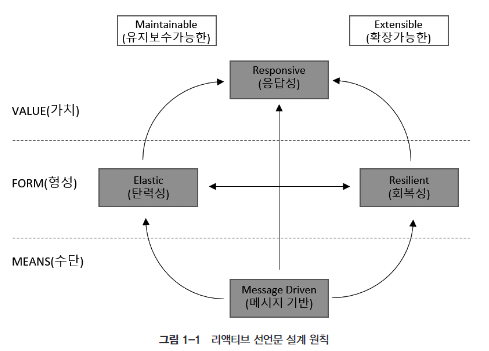
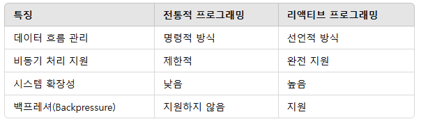

# Reactive System & Reactive Programming
## Reactive System 이란

1. VALUE (가치)
   * Responsive (응답성)
     * 시스템은 항상 빠르게 응답할 수 있어야 하며, 사용자의 요구나 입력에 적시에 반응해야 한다.
     * 이는 시스템의 유지보수 가능성(Maintainable)과 확장 가능성(Extensible)을 기반으로 한다.
2. FORM (형상)
   * Elastic (탄력성)
     * 시스템은 워크로드 변화에 따라 자원을 동적으로 할당할 수 있어야 하며, 과부하 상황에서도 성능을 유지해야 한다. 
     * 이는 확장성과 밀접하게 연결된다.
   * Resilient (회복성)
     * 시스템은 장애 상황에서도 복구할 수 있는 능력을 가져야 된다. 부분적인 실패가 전체 시스템에 영향을 주지 않아야 된다. 
     * 이는 유지보수성과 연관된다.
3. MEANS (수단)
   * Message-Driven (메시지 기반)
     * 비동기 메시지를 활용하여 컴포넌트 간 통신을 관리한다. 
     * 이를 통해 시스템의 느슨한 결합(loose coupling)과 강한 응집(strong cohesion)을 실현할 수 있다. 
     * 메시지 기반 방식은 탄력성과 회복성을 동시에 지원한다.
4. 정리
   1. 응답성(Responsive)은 시스템의 궁극적인 목표로, 이를 달성하기 위해 탄력성(Elastic)과 회복성(Resilient)이 필요하다.
   2. 탄력성은 시스템이 확장 가능성을, 회복성은 유지보수 가능성을 높힌다.
   3. 이 모든 특성은 메시지 기반(Message-Driven) 아키텍처를 통해 지원한다.

## Reactive Programming 이란
1. 리액티브 시스템을 구축하는데 필요한 프로그래밍 모델
2. '리액티브 시스템은 비동기 메시지 통신을 기반으로 한다'처럼 Blocking I/O 방식이 아닌 Non-Blocking I/O 방식의 통신을 한다.

### 핵심 개념
1. 데이터 스트림 
   * 시간에 따라 발생하는 데이터의 흐름(스트림)을 처리하는 데 초점이 맞춰져 있다.
   * 데이터는 이벤트, 메시지, 요청, 응답 등 여러 형태로 나타날 수 있다.
2. 비동기 처리 
   * 리액티브 프로그래밍은 데이터를 비동기적으로 처리한다. 이를 통해 시스템이 병목현상을 줄이고 더 높은 성능과 응답성을 제공할 수 있다.
3. 변화 전파 
   * 한 데이터의 변화가 발생하면 해당 데이터에 의존하는 다른 부분도 자동으로 업데이트된다.
4. Non-blocking 방식 
   * 시스템은 작업이 완료되기를 기다리지 않고, 자원을 효율적으로 활용하기 위해 Non-blocking 방식으로 설계된다.

### 특징
1. 선언적(Declarative)
   * "무엇을 할지"에 집중하며, "어떻게 할지"에 대한 구현은 추상화한다.
2. 시간 축(Time Axis) 기반 설계 
   * 데이터가 시간에 따라 변화하는 동작을 관리하는 데 중점을 둔다.
3. 이벤트 기반(Event-Driven)
   * 발생하는 이벤트를 기반으로 데이터 흐름과 작업을 정의한다.
4. Backpressure 처리 
   * 소비자가 처리 가능한 속도로 데이터를 받을 수 있도록 생산자와 소비자 간 속도 차이를 조율한다.

### 주요 이점
1. 확장성(Scalability)
   * 비동기적으로 작업을 처리하므로 더 많은 요청과 데이터를 처리할 수 있다.
2. 응답성(Responsiveness)
   * Non-blocking 방식을 통해 지연 시간을 줄이고, 시스템이 더 빠르게 응답할 수 있게 만든다.
3. 유지보수성(Maintainability)
   * 선언적 코드 작성과 데이터 흐름의 명확한 구조는 시스템 유지보수를 용이하게 한다.
4. 리소스 효율성(Resource Efficiency)
   * Non-blocking과 Backpressure 처리 덕분에 리소스를 효과적으로 활용할 수 있다.

### 리액티브 프로그래밍의 주요 프레임워크 및 라이브러리
1. RxJava / Project Reactor
   * 자바 환경에서 리액티브 프로그래밍을 구현하기 위한 라이브러리.
   * Project Reactor는 Spring WebFlux의 기반으로 사용됨.
2. Spring WebFlux
   * 리액티브 프로그래밍 모델을 지원하는 Spring의 웹 프레임워크.
3. Akka Streams
   * 스칼라와 자바를 위한 리액티브 스트림 구현.
4. Vert.x
   * 이벤트 기반 비동기 애플리케이션 개발을 위한 툴킷.

### 전통적 프로그래밍 VS 리액티브 프로그래밍


## 명령형 프로그래밍 VS 선언형 프로그래밍
### 명령형 프로그래밍
* 어떠한 작업을 처리 하기 위해 실행할 동작을 구체적으로 명시
```java
public class Imperative {
    public static void main(String[] args) {
        List<Integer> numbers = Arrays.asList(1, 3, 21, 10, 8, 11);
        int sum = 0;
        for (int number : numbers) {
            if (number > 6 && (number % 2 != 0)) {
                sum += number;
            }
        }

        System.out.println("sum: " + sum);
    }
}
```
* for 문을 작성하여 무슨 동작을 할지 구체적으로 명시함
* 조건에 맞는 숫자를 더하는 구체적인 처리방식을 명시
### 선언형 프로그래밍
* 실행할 동작을 구체적으로 명시하지 않고 목표만 선언하는 방식
```java
public class Declarative {
    public static void main(String[] args) {
        List<Integer> numbers = Arrays.asList(1, 3, 21, 10, 8, 11);
        int sum = numbers.stream()
                .filter(number -> number > 6 && (number % 2 != 0))
                .mapToInt(n -> n)
                .sum();

        System.out.println("sum = " + sum);
    }
}
```
* java의 stream이 for의 구체적인 동작을 대신함
* 구체적인 처리 방식을 명시하기 보다 메서드를 선언만 함

## 리액티브 프로그래밍 코드의 구성
* Publisher
  * 발행인, 발행자 등으로 부르며 입력으로 들어오는 데이터를 제공하는 역할을 함
* Subscriber
  * 구독자, 소비자로 부르며 Publisher가 제공한 데이터를 전달받아서 사용하는 주체
* Data Source
  * Publisher의 입력으로 들어오는 데이터 (리액티브 프로그래밍에서는 Data Stream이라고 함, 엄밀히 따지면 살짝 다름)
  * 최초로 생성되는 데이터 그 자체 (원천)
* Operator
  * Publisher와 Subscriber 사이에서 적절한 가공 처리를 담당
  * 리액티브 프로그래밍은 Operator로 시작하여 Operator로 끝남
  * 데이터를 생성, 필터링, 변환 등 수많은 Operator가 존재

# Reactive Streams
