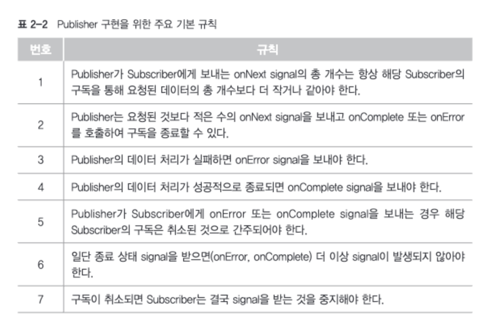
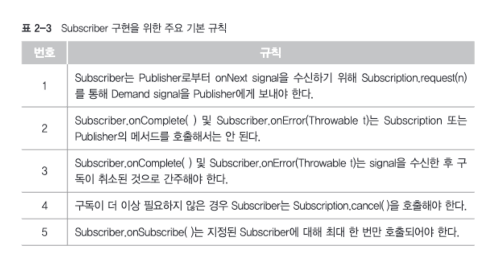
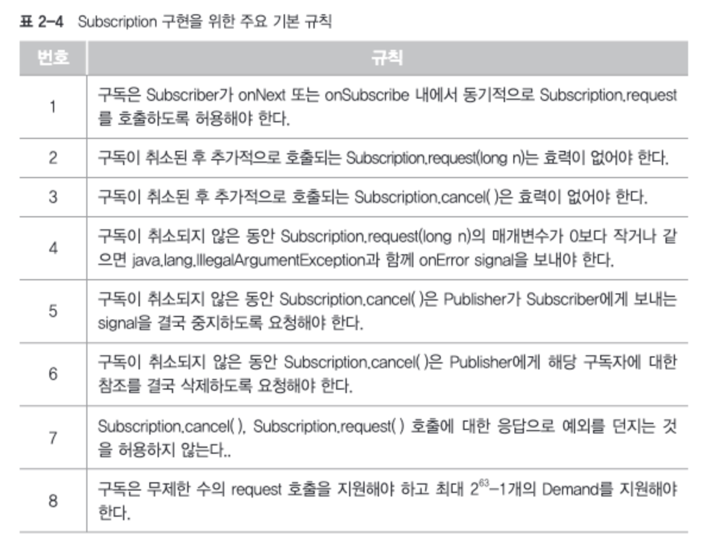
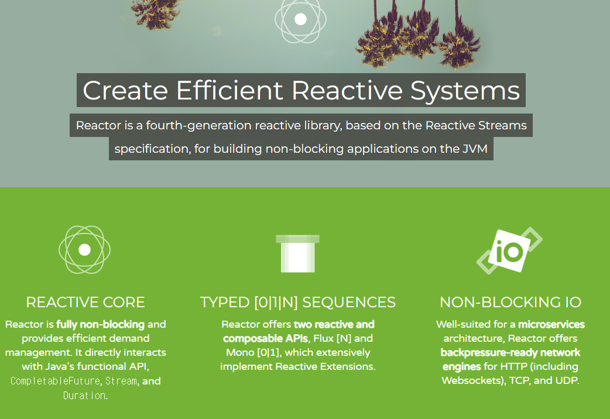
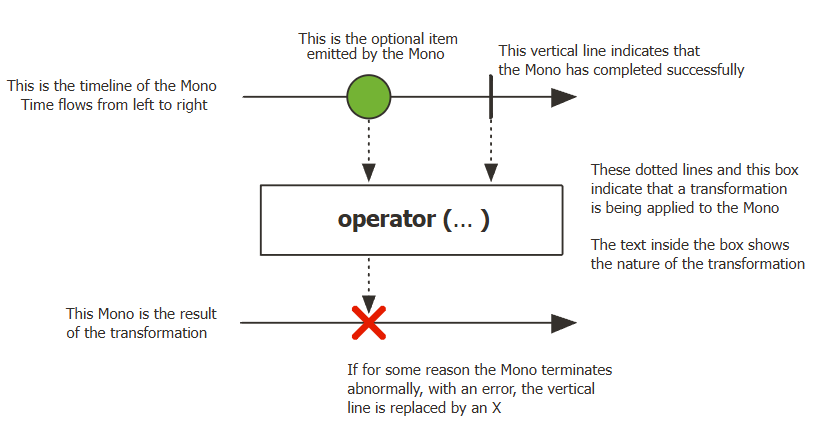
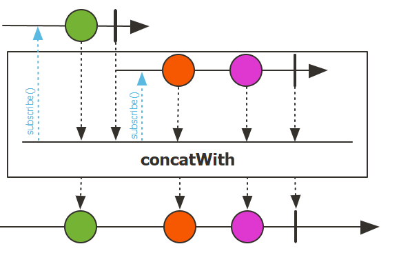

# Reactive System & Reactive Programming
## Reactive System 이란

1. VALUE (가치)
   * Responsive (응답성)
     * 시스템은 항상 빠르게 응답할 수 있어야 하며, 사용자의 요구나 입력에 적시에 반응해야 한다.
     * 이는 시스템의 유지보수 가능성(Maintainable)과 확장 가능성(Extensible)을 기반으로 한다.
2. FORM (형상)
   * Elastic (탄력성)
     * 시스템은 워크로드 변화에 따라 자원을 동적으로 할당할 수 있어야 하며, 과부하 상황에서도 성능을 유지해야 한다.
     * 이는 확장성과 밀접하게 연결된다.
   * Resilient (회복성)
     * 시스템은 장애 상황에서도 복구할 수 있는 능력을 가져야 된다. 부분적인 실패가 전체 시스템에 영향을 주지 않아야 된다.
     * 이는 유지보수성과 연관된다.
3. MEANS (수단)
   * Message-Driven (메시지 기반)
     * 비동기 메시지를 활용하여 컴포넌트 간 통신을 관리한다.
     * 이를 통해 시스템의 느슨한 결합(loose coupling)과 강한 응집(strong cohesion)을 실현할 수 있다.
     * 메시지 기반 방식은 탄력성과 회복성을 동시에 지원한다.
4. 정리
   1. 응답성(Responsive)은 시스템의 궁극적인 목표로, 이를 달성하기 위해 탄력성(Elastic)과 회복성(Resilient)이 필요하다.
   2. 탄력성은 시스템이 확장 가능성을, 회복성은 유지보수 가능성을 높힌다.
   3. 이 모든 특성은 메시지 기반(Message-Driven) 아키텍처를 통해 지원한다.

## Reactive Programming 이란
1. 리액티브 시스템을 구축하는데 필요한 프로그래밍 모델
2. '리액티브 시스템은 비동기 메시지 통신을 기반으로 한다'처럼 Blocking I/O 방식이 아닌 Non-Blocking I/O 방식의 통신을 한다.

### 핵심 개념
1. 데이터 스트림
   * 시간에 따라 발생하는 데이터의 흐름(스트림)을 처리하는 데 초점이 맞춰져 있다.
   * 데이터는 이벤트, 메시지, 요청, 응답 등 여러 형태로 나타날 수 있다.
2. 비동기 처리
   * 리액티브 프로그래밍은 데이터를 비동기적으로 처리한다. 이를 통해 시스템이 병목현상을 줄이고 더 높은 성능과 응답성을 제공할 수 있다.
3. 변화 전파
   * 한 데이터의 변화가 발생하면 해당 데이터에 의존하는 다른 부분도 자동으로 업데이트된다.
4. Non-blocking 방식
   * 시스템은 작업이 완료되기를 기다리지 않고, 자원을 효율적으로 활용하기 위해 Non-blocking 방식으로 설계된다.

### 특징
1. 선언적(Declarative)
   * "무엇을 할지"에 집중하며, "어떻게 할지"에 대한 구현은 추상화한다.
2. 시간 축(Time Axis) 기반 설계
   * 데이터가 시간에 따라 변화하는 동작을 관리하는 데 중점을 둔다.
3. 이벤트 기반(Event-Driven)
   * 발생하는 이벤트를 기반으로 데이터 흐름과 작업을 정의한다.
4. Backpressure 처리
   * 소비자가 처리 가능한 속도로 데이터를 받을 수 있도록 생산자와 소비자 간 속도 차이를 조율한다.

### 주요 이점
1. 확장성(Scalability)
   * 비동기적으로 작업을 처리하므로 더 많은 요청과 데이터를 처리할 수 있다.
2. 응답성(Responsiveness)
   * Non-blocking 방식을 통해 지연 시간을 줄이고, 시스템이 더 빠르게 응답할 수 있게 만든다.
3. 유지보수성(Maintainability)
   * 선언적 코드 작성과 데이터 흐름의 명확한 구조는 시스템 유지보수를 용이하게 한다.
4. 리소스 효율성(Resource Efficiency)
   * Non-blocking과 Backpressure 처리 덕분에 리소스를 효과적으로 활용할 수 있다.

### 리액티브 프로그래밍의 주요 프레임워크 및 라이브러리
1. RxJava / Project Reactor
   * 자바 환경에서 리액티브 프로그래밍을 구현하기 위한 라이브러리.
   * Project Reactor는 Spring WebFlux의 기반으로 사용됨.
2. Spring WebFlux
   * 리액티브 프로그래밍 모델을 지원하는 Spring의 웹 프레임워크.
3. Akka Streams
   * 스칼라와 자바를 위한 리액티브 스트림 구현.
4. Vert.x
   * 이벤트 기반 비동기 애플리케이션 개발을 위한 툴킷.
5. Java 9 Flow Api
   * 자바 정식 Api
   * 구현체 역할이 아닌 Spi 역할을 함
   * 실제로 다른 구현체들은 Flow Api 로 변환할 수 있는 어댑터를 지원함

## 리액티브 프로그래밍 코드의 구성
* Publisher
    * 발행인, 발행자 등으로 부르며 입력으로 들어오는 데이터를 제공하는 역할을 함
* Subscriber
    * 구독자, 소비자로 부르며 Publisher가 제공한 데이터를 전달받아서 사용하는 주체
* Data Source
    * Publisher의 입력으로 들어오는 데이터 (리액티브 프로그래밍에서는 Data Stream이라고 함, 엄밀히 따지면 살짝 다름)
    * 최초로 생성되는 데이터 그 자체 (원천)
* Operator
    * Publisher와 Subscriber 사이에서 적절한 가공 처리를 담당
    * 리액티브 프로그래밍은 Operator로 시작하여 Operator로 끝남
    * 데이터를 생성, 필터링, 변환 등 수많은 Operator가 존재

### 전통적 프로그래밍 VS 리액티브 프로그래밍


## 명령형 프로그래밍 VS 선언형 프로그래밍
### 명령형 프로그래밍
* 어떠한 작업을 처리 하기 위해 실행할 동작을 구체적으로 명시
```java
public class Imperative {
    public static void main(String[] args) {
        List<Integer> numbers = Arrays.asList(1, 3, 21, 10, 8, 11);
        int sum = 0;
        for (int number : numbers) {
            if (number > 6 && (number % 2 != 0)) {
                sum += number;
            }
        }

        System.out.println("sum: " + sum);
    }
}
```
* for 문을 작성하여 무슨 동작을 할지 구체적으로 명시함
* 조건에 맞는 숫자를 더하는 구체적인 처리방식을 명시
### 선언형 프로그래밍
* 실행할 동작을 구체적으로 명시하지 않고 목표만 선언하는 방식
```java
public class Declarative {
    public static void main(String[] args) {
        List<Integer> numbers = Arrays.asList(1, 3, 21, 10, 8, 11);
        int sum = numbers.stream()
                .filter(number -> number > 6 && (number % 2 != 0))
                .mapToInt(n -> n)
                .sum();

        System.out.println("sum = " + sum);
    }
}
```
* java의 stream이 for의 구체적인 동작을 대신함
* 구체적인 처리 방식을 명시하기 보다 메서드를 선언만 함

# Reactive Streams
## 리액티브 스트림즈란?
* 데이터 스트림을 Non-Blocking이면서 비동기적인 방식으로 처리하기 위한 리액티브 라이브러리(구현체)의 표준 사양

## 구성요소

### Publisher
```java
public interface Publisher<T> {
    void subscribe(Subscriber<? super T> subscriber);
}
```
* 리액티브 스트림즈에서의 Publisher와 Subscriber는 개념상으로 Subscriber가 구독하는게 맞다
* 실제 코드상으론 Publisher가 subscribe 메서드의 파라미터인 Subscriber를 등록하는 형태로 구독이 이뤄진다.
* 이러한 점에서 기타 메시지 시스템의 pub/sub구조와 차이가 있다.
### Subscriber
```java
public interface Subscriber<T> {
    void onSubscribe(Subscription subscription);
    void onNext(T t);
    void onError(Throwable throwable);
    void onComplete();
}
```
* onSubscribe
  * 구독 시작 시점에 어떤 처리를 할지한다.
  * Publisher에게 요청할 데이터의 개수를 지정하거나 구독을 해지하는 것을 의미
  * Subscribtion 객체를 통해 이뤄진다.
* onNext
  * Publisher가 통지한 데이터를 처리하는 역할
* onError
  * 통지된 데이터 처리 과정에서 발생 시 처리하는 역할
* onComplete
  * 데이터 통지가 완료되었을때 호출되는 메서드
  * 후처리가 필요하다면 해당 메서드를 사용
### Subscription
```java
public interface Subscription {
    void request(long n);
    void cancel();
}
```
* Subscriber가 구독한 데이터의 개수를 요청
* 데이터 요청의 취소 즉 구독을 해지 하는 역할
### Processor
```java
public interface Processor<T, R> extends Subscriber<T>, Publisher<T>{
}
```
* Subscriber와 Publisher의 기능을 모두 갖는다.
## 관련 용어
### Signal
* Publisher와 Subscriber간에 주고 받는 상호작용
* onSubscribe, onNext, request, cancel 메서드 같은 것을 Signal 이라고 함
* onSubscribe, onNext등은 Subscriber 인터페이스에 정의되어 있지만 실 사용 주체는 Publisher이기 때문에 Publisher가 Subscriber에게 보내는 Signal이라고 볼 수 있음
### Demand
* '수요', '요구'의 의미를 지님
* Publisher가 아직 Subscriber에게 전달하지 않은 Subscriber가 요청하는 데이터를 의미함
### Emit
* Publisher가 Subscriber에게 데이터를 전달하는 것
### Upstream/Downstream
* Upstream
  * 데이터를 발행하거나 생성하는 쪽을 의미
  * 데이터가 시작되는 출발점
* Downstream
  * 소비하거나 처리하는 쪽
  * 데이터가 전달되어 도달하는 목적지
```java
public class Example {
    public static void main(String[] args) {
        Flux.just(1, 2, 3, 4, 5, 6)
                .filter(n -> n % 2 == 0)
                .map(n -> n * 2)
                .subscribe(System.out::println);
    }
}
```
1. 데이터를 생성하는 just로 반환된 Flux기준으로 filter로 부터 반환된 Flux가 하위에 있기 때문에 Downstream
2. filter로 부터 반환된 Flux기준으로 just의 Flux는 Upstream
### Sequence
* Publisher가 emit하는 데이터의 연속적인 흐름을 정의해 놓은 것 자체
* Operator 체인 형태로 정의됨
* 위 코드와 같이 데이터를 생성, emit하고 filter를 거쳐 map을 통해 반환하는 과정을 예로 들 수 있음
### Operator
* 연산자
* just, filter, map과 같은 것
### Source
* Data Source, Source Publisher, Source Flux 등과 같이 쓰임
* 최초에 가장 먼저 생성된 무언가
    
## 구현 규칙
* 구성 요소별로 어떻게 구현해야하는지 기본적인 규칙들이 정의되어 있음

### Publisher

### Subscriber

* 1번은 데이터를 얼마나 언제 수신할 수 있는지 결정하는 책임이 Subscriber에 있다는 것을 확립
  * 리액티브 스트림즈에서는 한 번에 하나의 데이터를 요청하기 보다 처리할 수 있는 적절한 상한선 까지의 데이터 개수를 권장함
* 2번은 Publisher/Subscription과 Subscriber간의 순환 및 경쟁, 재귀호출을 막기위함임
### Subscription

* 7번 일반적으로 Java는 메서드 호출 시 예외를 호출한 쪽으로 던지는데, 리액티브 스트림즈에서는 해당 예외를 onError Signal과 함께 보내도록 규정되어 있음


# Project Reactor
## Reactor

Publisher-Subscriber 모델을 기반으로 한 Non-Blocking 완벽한 지원, Java 함수형 API을 통해 상호작용함
* Publisher: 데이터를 생성하고 발행하는 역할
* Subscriber: Publisher로부터 데이터를 구독하고 처리

두 가지 주요 Publisher를 제공
* Mono: 0 또는 1개의 아이템을 발행
* Flux: 0에서 N개의 아이템을 발행

Backpressure ready network
* Publisher로 부터 전달 받은 데이터를 처리 시 과부하가 걸리지 않게 제어하는 개념

### Mono
* 단일 데이터, 빈 결과를 처리할 때 사용
* 예: 단일 HTTP 요청, DB에서 하나의 레코드 조회
```java
public class MonoExample {
    public static void main(String[] args) {
        Mono<String> mono = Mono.just("Hello Reactor");
        mono.map(String::toUpperCase)
                .subscribe(System.out::println);
    }
} 
```
### Flux
* 여러 데이터 처리
* 예: 스트리밍 데이터, 다중 레코드 처리, 이벤트 스트림 등 
```java
public class FluxExample {
    public static void main(String[] args) {
        Flux<String> flux = Flux.just("Hello", "Reactor", "World");
        flux.map(String::toLowerCase)
                .subscribe(System.out::println);
    }
}
```
## 마블다이어그램
* 마블 다이어그램은 리액티브 스트림의 동작을 시각적으로 표현한 것
* 시간에 따른 데이터 흐름을 화살표와 기호로 나타냄
* 각 연산자(Operator)가 데이터 스트림에 어떤 영향을 미치는지 이해하는 데 유용함

1. Mono(Publisher)의 타임라인(Upstream)
2. emit하는 데이터, 시간 흐름으로 표현하기 때문에 가장 왼쪽의 데이터가 가장 먼저 emit된 데이터
3. Mono Sequence의 종료(onComplete Signal)
4. emit된 데이터를 처리하는 operator
5. operator를 거쳐 변환된 데이터의 타임라인 (Downstream)
6. 에러 혹은 강제 종료가 발생한다면 'X'로 표기함(onError Signal)
```java
public class FluxExample2 {
    public static void main(String[] args) {
        Flux<String> flux = Mono.just("Hello")
                .concatWith(Flux.just("World", "ConcatWith"));
        flux.subscribe(System.out::println);
    }
}
```

* Mono의 concatWith operator이기 때문에 operator 범위 밖의 타임라인엔 한개의 데이터가 emit
* 범위 안의 타임라인엔 Mono, Flux 상관 없다.
* 두 개의 데이터 소스를 연결하여 하나의 Flux가 되어 차례 대로 emit
## Cold Sequence
* 구독(subscribe)이 발생할 때마다 데이터 스트림이 처음부터 시작
* 각 구독자는 독립적인 데이터 스트림을 받습니다.
* 예: 파일을 읽는 작업, 데이터베이스 쿼리 결과 스트림.
```java
public class ColdSequence {
    public static void main(String[] args) throws InterruptedException {
        List<String> input = Arrays.asList("Apple", "Banana", "Kiwi");
        Flux<String> cold = Flux.fromIterable(input)
                .map(String::toUpperCase);
        cold.subscribe(System.out::println);
        System.out.println("=============================================");
        Thread.sleep(3000);
        cold.subscribe(System.out::println);
    }
}
```
## Hot Sequence
* 데이터 스트림은 구독과 관계없이 이미 진행 중일 수 있음
* 구독자는 스트림 중간부터 데이터를 받을 수 있습니다.
* 예: 실시간 주식 가격, 이벤트 스트림.
```java
public class HotSequence {
    public static void main(String[] args) throws InterruptedException {
        List<String> input = Arrays.asList("Apple", "Banana", "Kiwi", "Pear", "Mango", "Orange");
        Flux<String> hot = Flux.fromIterable(input)
                .delayElements(Duration.ofSeconds(1))
                .share();

        hot.subscribe(fruit -> System.out.println(LocalDateTime.now().format(DateTimeFormatter.ofPattern("mm:ss")) + " (1) Fruit call: " + fruit));

        Thread.sleep(2500);

        hot.subscribe(fruit -> System.out.println(LocalDateTime.now().format(DateTimeFormatter.ofPattern("mm:ss")) + " (2) Fruit call: " + fruit));

        Thread.sleep(4000);

    }
}
```
## Backpressure
Backpressure는 Subscriber가 Publisher에게 데이터 발행 속도를 조절하도록 요청하는 메커니즘, Reactor는 기본적으로 Backpressure를 지원하며, onBackpressureBuffer, onBackpressureDrop 등의 연산자를 제공
### 전략
* Request(n): Subscriber가 Publisher에게 n개의 아이템을 요청
* Drop: 처리할 수 없는 데이터는 버림
* Error: 버퍼가 가득 찰 경우 에러
* Latest: 최근 데이터부터 버퍼에 채움
* Buffer: 버퍼안에 있는 데이터부터 Drop
### 방법
1. 데이터 개수 제어
```java
public class BackPressureRequest {
    public static void main(String[] args) {
        Flux.range(1, 5)
                .doOnRequest(d -> System.out.println("request cnt: " + d))
                .subscribe(new BaseSubscriber<>() {
                    @Override
                    protected void hookOnSubscribe(Subscription subscription) {
                        request(1);
                    }

                    @Override
                    protected void hookOnNext(Integer value) {
                        try {
                            Thread.sleep(1000L);
                            System.out.println("hookOnNext: " + value);
                            request(1);
                        } catch (InterruptedException e) {
                            throw new RuntimeException(e);
                        }
                    }
                });
    }
}
```
요청 개수를 BaseSubscriber를 이용하여 제어할 수 있다.
2. Backpressure 전략 사용
* Error
```java
public class BackPressureError {
    public static void main(String[] args) throws InterruptedException {
        Flux.interval(Duration.ofMillis(1)) // 0.001초 emit
                .onBackpressureError()
                .doOnNext(d -> System.out.println("doOnNext: " + d)) // Publisher가 emit한 데이터를 확인하거나 추가 동작 정의, 디버깅용도로 사용
                .publishOn(Schedulers.parallel())
                .subscribe(d -> {
                            try {
                                Thread.sleep(5L); // 0.005초 처리
                            } catch (InterruptedException e) {}
                            System.out.println("onNext: " + d);
                        },
                        e -> System.out.println("onError: " + e));

        Thread.sleep(2000);
    }
}
```
* Drop
```java
public class BackPressureDrop {
    public static void main(String[] args) throws InterruptedException {
        Flux.interval(Duration.ofMillis(1)) // 0.001초 emit
                .onBackpressureDrop(drop -> System.out.println("drop: " + drop))
                .doOnNext(d -> System.out.println("doOnNext: " + d)) // Publisher가 emit한 데이터를 확인하거나 추가 동작 정의, 디버깅용도로 사용
                .publishOn(Schedulers.parallel())
                .subscribe(d -> {
                            try {
                                Thread.sleep(5L); // 0.005초 처리
                            } catch (InterruptedException e) {}
                            System.out.println("onNext: " + d);
                        },
                        e -> System.out.println("onError: " + e));

        Thread.sleep(2000);
    }
}
```
* Latest
```java
public class BackPressureLatest {
    public static void main(String[] args) throws InterruptedException {
        Flux.interval(Duration.ofMillis(1)) // 0.001초 emit
                .onBackpressureLatest()
                .doOnNext(d -> System.out.println("doOnNext: " + d)) // Publisher가 emit한 데이터를 확인하거나 추가 동작 정의, 디버깅용도로 사용
                .publishOn(Schedulers.parallel())
                .subscribe(d -> {
                            try {
                                Thread.sleep(5L); // 0.005초 처리
                            } catch (InterruptedException e) {}
                            System.out.println("onNext: " + d);
                        },
                        e -> System.out.println("onError: " + e));

        Thread.sleep(2000);
    }
}
```
* Buffer - DROP_LATEST
최근 버퍼에 채워진 데이터 drop
```java
public class BackPressureDropLatest {
    public static void main(String[] args) throws InterruptedException {
        Flux.interval(Duration.ofMillis(300L))
                .doOnNext(d -> System.out.println("emmited by original: " + d))
                .onBackpressureBuffer(2,
                        d -> System.out.println("overflow and dropped: " + d),
                        BufferOverflowStrategy.DROP_LATEST)
                .doOnNext(d -> System.out.println("emmited by buffer: " + d))
                .publishOn(Schedulers.parallel(), false, 1)
                .subscribe(d -> {
                            try {
                                Thread.sleep(1000L);
                            } catch (InterruptedException e) {
                            }
                            System.out.println("onNext: " + d);
                        },
                        e -> System.out.println("onError: " + e));

        Thread.sleep(3000L);
    }
}
```
* Buffer - DROP_OLDEST
버퍼에서 가장 오래된 데이터를 Drop
```java
public class BackPressureDropOldest {
    public static void main(String[] args) throws InterruptedException {
        Flux.interval(Duration.ofMillis(300L))
                .doOnNext(d -> System.out.println("emmited by original: " + d))
                .onBackpressureBuffer(2,
                        d -> System.out.println("overflow and dropped: " + d),
                        BufferOverflowStrategy.DROP_OLDEST)
                .doOnNext(d -> System.out.println("emmited by buffer: " + d))
                .publishOn(Schedulers.parallel(), false, 1)
                .subscribe(d -> {
                            try {
                                Thread.sleep(1000L);
                            } catch (InterruptedException e) {
                            }
                            System.out.println("onNext: " + d);
                        },
                        e -> System.out.println("onError: " + e));

        Thread.sleep(3000L);
    }
}
```
## Sinks
* 프로그래밍 방식으로 데이터 스트림을 생성하고 제어할 수 있게 한다.
* Sinks는 Reactor의 Mono와 Flux를 생성하고 관리하는 데 유용하다
* 특히 외부 이벤트를 리액티브 스트림으로 변환할 때 매우 강력함
### 역할
* 데이터 발행: 프로그래밍 방식으로 Mono 또는 Flux에 데이터를 발행
* 스트림 제어: 스트림의 시작, 완료, 오류를 명시적으로 제어
* 다중 구독 지원: 여러 Subscriber가 동일한 Sinks를 구독
### 기존 create를 이용한 싱글스레드 기반 signal 전송
```java
public class CreateOperator {
    public static void main(String[] args) throws InterruptedException {
        int tasks = 6;
        Flux.create((FluxSink<String> sink) -> {
                    IntStream.range(1, tasks)
                            .forEach(n -> sink.next(doTasks(n)));
                })
                .subscribeOn(Schedulers.boundedElastic())
                .doOnNext(n -> System.out.println(Thread.currentThread().getName() + " create: " + n))
                .publishOn(Schedulers.parallel())
                .map(res -> res + " success!")
                .doOnNext(n -> System.out.println(Thread.currentThread().getName() + " map: " + n))
                .publishOn(Schedulers.parallel())
                .subscribe(n -> System.out.println(Thread.currentThread().getName() + " subscribe: " + n));

        Thread.sleep(1000L);
    }

    private static String doTasks(int taskNum) {
        return "task " + taskNum + " result";
    }
}
```
* 기존에도 프로그래밍 방식으로 Signal을 전송할 수 있었다.
* 또한 Sequence를 단계적으로 나누어 여러 개의 스레드에서 처리할 수도 있었다.
여러 개의 스레드에서 각각의 전혀 다른 작업들을 처리한 다음 처리 결과를 반환하려 한다면 Sinks를 사용하면 된다.
```java
public class SinkExample1 {
    public static void main(String[] args) throws InterruptedException {
        int tasks = 6;

        Sinks.Many<String> unicastSink = Sinks.many().unicast().onBackpressureBuffer();
        IntStream.range(1, tasks)
                .forEach(n -> {
                    try {
                        new Thread(() -> {
                            unicastSink.emitNext(doTasks(n), Sinks.EmitFailureHandler.FAIL_FAST);
                            System.out.println(Thread.currentThread().getName() + " emited: " + n);
                        }).start();
                        Thread.sleep(100L);
                    } catch (InterruptedException e) {
                        System.out.println("e.getMessage() = " + e.getMessage());
                    }
                });

        unicastSink.asFlux()
                .publishOn(Schedulers.parallel())
                .map(res -> res + " success!")
                .doOnNext(n -> System.out.println(Thread.currentThread().getName() + " map: " + n))
                .publishOn(Schedulers.parallel())
                .subscribe(n -> System.out.println(Thread.currentThread().getName() + " subscribe: " + n));

        Thread.sleep(1000L);
    }

    private static String doTasks(int taskNum) {
        return "task " + taskNum + " result";
    }
}
```
* doTasks() 메서드가 루프를 돌 때마다 새로운 스레드에서 실행됨
* 프로그래밍 방식으로 Signal을 전송할 수 있으며, 스레드 안전성을 보장 받을 수 있다.
### Sinks.one
```java
public class SinksOne {
    public static void main(String[] args) {
        Sinks.One<Object> one = Sinks.one();
        Mono<Object> mono = one.asMono();

        one.emitValue("Hello Reactor", Sinks.EmitFailureHandler.FAIL_FAST);
        one.emitValue("Hi Reactor", Sinks.EmitFailureHandler.FAIL_FAST);

        mono.subscribe(System.out::println);
        mono.subscribe(System.out::println);
    }
}
```
* One 명세: 한 건의 데이터를 프로그래밍 방식으로 emit하는 역할을 함, Mono 방식으로 Subscriber가 소비할 수 있도록 해 주는 사양
* emitValue를 통해 emit 도중 에러를 어떻게 처리할 건지 정의
### Sinks.many
1. Unicast
```java
public class SinksManyUnicast {
    public static void main(String[] args) {

        Sinks.Many<Integer> sink = Sinks.many().unicast().onBackpressureBuffer();
        Flux<Integer> flux = sink.asFlux();

        sink.emitNext(1, Sinks.EmitFailureHandler.FAIL_FAST);
        sink.emitNext(2, Sinks.EmitFailureHandler.FAIL_FAST);

        flux.subscribe(System.out::println);

        sink.emitNext(3, Sinks.EmitFailureHandler.FAIL_FAST);

        // Sinks.many().unicast() sinks only allow a single Subscriber
        // flux.subscribe(System.out::println);  
    }
}
```
* 이름 그대로 하나의 Subscriber에게만 전달함 두번 구독 할 시 에러
2. Multicast
```java
public class SinksManyMulticast {
    public static void main(String[] args) {

        Sinks.Many<Integer> sink = Sinks.many().multicast().onBackpressureBuffer();
        Flux<Integer> flux = sink.asFlux();

        sink.emitNext(1, Sinks.EmitFailureHandler.FAIL_FAST);
        sink.emitNext(2, Sinks.EmitFailureHandler.FAIL_FAST);

        // sinks -> hot Publisher, onBackPressureBuffer -> Warm up의 의미를 가지는 Hot Sequence
        flux.subscribe(d -> System.out.println("sub1: " + d));

        flux.subscribe(d -> System.out.println("sub2: " + d));

        sink.emitNext(3, Sinks.EmitFailureHandler.FAIL_FAST);
    }
}
```
* 다수의 Subscriber에게 데이터를 emit
3. Multicast Replay
```java
public class SinksManyMulticastReplay {
    public static void main(String[] args) {

        Sinks.Many<Integer> sink = Sinks.many().replay().limit(2);
        Flux<Integer> flux = sink.asFlux();

        sink.emitNext(1, Sinks.EmitFailureHandler.FAIL_FAST);
        sink.emitNext(2, Sinks.EmitFailureHandler.FAIL_FAST);
        sink.emitNext(3, Sinks.EmitFailureHandler.FAIL_FAST);
        
        flux.subscribe(d -> System.out.println("sub1: " + d));

        sink.emitNext(4, Sinks.EmitFailureHandler.FAIL_FAST);

        flux.subscribe(d -> System.out.println("sub2: " + d));
    }
}
```
* 이름 그대로 emit된 데이터를 다시 replay하여 구독 전에 이미 emit된 데이터라도 전달 할 수 있게 함
* limit은 가장 나중에 emit된 데이터부터 다시 전달하는 기능
* 카세트의 replay 버튼과 유사함
## Scheduler
* 이를 통해 작업의 실행 컨텍스트(예: 스레드 풀, 스레드 전략)를 제어
* Scheduler는 리액티브 프로그래밍에서 비동기 및 논블로킹 처리를 구현하는 데 필수적인 역할을 함
### 역할
1. 스레드 관리: 작업을 실행할 스레드를 지정하고 관리
2. 비동기 실행: 작업을 비동기적으로 실행
3. 리소스 제어: 스레드 풀의 크기와 동작 방식을 제어해 리소스를 효율적으로 사용
### Schedules.immediate()
* 현재 스레드에서 작업을 즉시 수행
```java
public class SchedulersImmediate {
    public static void main(String[] args) throws InterruptedException {
        Flux.just(1, 2, 3, 4)
                .publishOn(Schedulers.parallel())
                .filter(d -> d % 2 == 0)
                .doOnNext(d -> System.out.println(Thread.currentThread().getName() + " filter: " + d))
                .publishOn(Schedulers.immediate())
                .map(d -> d * 2)
                .doOnNext(d -> System.out.println(Thread.currentThread().getName() + " map: " + d))
                .subscribe(d -> System.out.println(Thread.currentThread().getName() +  " onNext: " + d));

        Thread.sleep(1000);
    }
}
```
### Schedules.single()
* 첫 호출에서 생성된 스레드를 사용
```java
public class SchedulersSingle {
    public static void main(String[] args) throws InterruptedException {
        doTask("task1")
                .subscribe(d -> System.out.println(Thread.currentThread().getName() + " onNext: " + d));

        doTask("task2")
                .subscribe(d -> System.out.println(Thread.currentThread().getName() + " onNext: " + d));

        Thread.sleep(1000);
    }

    private static Flux<Integer> doTask(String name) {
        return Flux.just(1, 2, 3, 4)
                .publishOn(Schedulers.single())
                .filter(d -> d > 3)
                .doOnNext(d -> System.out.println(Thread.currentThread().getName() + ", " + name + ", filter: " + d))
                .map(d -> d * 10)
                .doOnNext(d -> System.out.println(Thread.currentThread().getName() + ", " + name + " map: " + d));
    }
}

```
### Schedules.newSingle()
* 호출할 때마다 새로운 스레드를 생성하여 사용
```java
public class SchedulersNewSingle {
    public static void main(String[] args) throws InterruptedException {
        doTask("task1")
                .subscribe(d -> System.out.println(Thread.currentThread().getName() + " onNext: " + d));

        doTask("task2")
                .subscribe(d -> System.out.println(Thread.currentThread().getName() + " onNext: " + d));

        Thread.sleep(1000);
    }

    private static Flux<Integer> doTask(String name) {
        return Flux.just(1, 2, 3, 4)
                .publishOn(Schedulers.newSingle("new-single", true)) // 데몬스레드 여부, 주 스레드가 종료되면 자동 종료
                .filter(d -> d > 3)
                .doOnNext(d -> System.out.println(Thread.currentThread().getName() + ", " + name + ", filter: " + d))
                .map(d -> d * 10)
                .doOnNext(d -> System.out.println(Thread.currentThread().getName() + ", " + name + " map: " + d));
    }
}
```
### Schedules.boundedElastic()
* Blocking I/O 작업을 효과적으로 처리, 긴 시간이 필요한 Blocking I/O 작업이 포함된 경우 다른 Non-Blocking 처리에 받해되지 않도록 이용 
* ExecutorService 기반의 스레드풀을 이용
* CPU 코어수 * 10만큼의 스레드를 생성하여, 최대 100,000개의 작업이 큐에서 대기 할 수 있다.
* HTTP 요청과 같은 Blocking I/O 작업을 통해 전달받은 데이터를 데이터 소스로 사용할 때 유용
### Schedules.parallel()
* CPU 코어수 만큼의 스레드를 생성
* Non-Blocking I/O에 최적화
### Schedules.fromExecutorService()
* 기존에 ExecutorService를 이용하여 사용
### Schedules.newXXX()
* newSingle, newBoundedElastic, newParallel 과 같은 메서드들이 존재
* 기본적인 single()과 같은건 디폴트 Scheduler 인스턴스를 사용
* new메서드들은 새로운 Scheduler 인스턴스를 생성하여 사용
* 스레드 이름, 디폴트 스레드 개수, 스레드 유휴시간, 데몬스레드로의 동작 여부 등을 커스텀
## Context
* Context는 Project Reactor에서 리액티브 스트림 내에서 전역적으로 사용할 수 있는 키-값 저장소
* Reactor의 Mono와 Flux는 불변(immutable)하고 함수형 프로그래밍 스타일을 따르기 때문에, 전역 상태를 공유하기 어려운 부분이 있음
* Context는 이러한 문제를 해결하기 위해 도입된 기능으로, 스트림 내에서 데이터를 전달하고 공유할 수 있게 해줌
### 예시
* ServletContext: Servlet이 Servlet Container와 통신하기 위해 필요한 정보를 제공하는 인터페이스
* ApplicationContext: Spring Framework에서 Spring Bean 객체의 정보를 제공
* SecurityContext: Spring Security에서 SecurityContextHolder를 통해 관리되며, 사용자 인증정보를 제공하는 인터페이스
### 역할
* 데이터 전달: 스트림 내에서 데이터를 전역적으로 전달할 수 있다.
* 상태 공유: 여러 연산자 또는 Subscriber 간에 상태를 공유할 수 있다.
* 컨텍스트 기반 작업: 로깅, 트랜잭션 관리, 인증 정보 전달 등에 사용 됨.
### 특징
* 불변성(Immutable): Context는 불변 객체로, 수정할 때마다 새로운 Context가 생성(구독이 발생할 때마다 구독과 연결되어 새로 생성)
* 스레드 안전성(Thread-Safe): 불변성 덕분에 스레드 간에 안전하게 공유 됨
* 계층적 구조: Context는 계층적 구조를 가지며, 상위 Context에서 하위 Context로 데이터를 전달할 수 있다.
### 사용법
* Context는 Mono 또는 Flux의 contextWrite 메서드를 통해 설정
* deferContextual 또는 transformDeferredContextual을 통해 읽을 수 있다.
```java
public class ContextExample2 {
    public static void main(String[] args) throws InterruptedException {
        String key1 = "company";
        String key2 = "name";

        Mono.deferContextual(ctx -> Mono.just(ctx.get(key1))) // Context에는 apple, bill이 존재, apple을 반환
                .publishOn(Schedulers.parallel())
                .contextWrite(ctx -> ctx.put(key2, "bill"))
                .transformDeferredContextual((mono, ctx) -> mono.map(d -> d + ", " + ctx.getOrDefault(key2, "steve"))) // 이 시점에 stream의 context에는 apple만 존재 그러므로 apple, steve가 반환
                .contextWrite(ctx -> ctx.put(key1, "apple"))
                .subscribe(d -> System.out.println("onNext: " + d));

        Thread.sleep(1000);
    }
}
```
* Context의 전파 방식은 Stack과 유사하며 LIFO 방식으로 처리 된다.